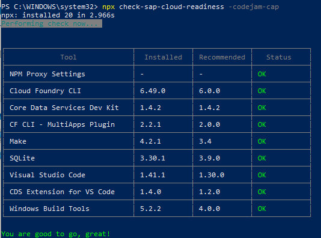

# Exercise 01 - Install the CAP Tooling

In this exercise you will get comfortable with the CAP tooling which you have installed using the prerequisites document we sent out.

## Steps

After completing these steps you'll have a working local environment for development of CAP based projects with Node.js, using the CAP "development kit" package `@sap/cds-dk`.

### 1. Install the CDS command line tool

The CDS command line tool is the heart of everything you do when developing CAP services locally. It is Node.js based and comes in the form of an NPM package (which further depends on other packages). The package and its dependencies are in the `@sap` namespace and are available from the [SAP NPM registry](https://blogs.sap.com/2017/05/16/sap-npm-registry-launched-making-the-lives-of-node.js-developers-easier/).

:point_right: First, relate the `@sap` namespace to the SAP NPM registry:

```
npm set @sap:registry=https://npm.sap.com
```

:point_right: Check that this setting is now saved in your configuration, with:

```
npm config ls
```

:exclamation: There is currently an issue with the latest @sap/cds-dk node module, so if you had issues with installing it you can try via yarn or install a specific version:

```
npm i -g @sap/cds-dk@1.4.4
```

### 2. Install the CDS extension for VS code

To efficiently and comfortably develop CAP based services with CDS, there is an extension for the [VS Code](https://code.visualstudio.com/) IDE. This is available to download from the [SAP Development Tools](https://tools.hana.ondemand.com/) website.

Extensions can be installed directly in VS Code from the extension marketplace, or manually from a file. In this case the extension for CDS language support is available in the form of a file.

:point_right: Go to the [Cloud section of the SAP Development Tools website](https://tools.hana.ondemand.com/#cloud) and find the "CDS Language Support for Visual Studio Code" section. Follow the instructions there to download and subsequently install the extension.

### 3. Verify your development environment

:point_right: Run the following command from the terminal to check whether all required tools are installed (this is an experimental tool, please contact the instructor if you have any questions):

```
npx check-sap-cloud-readiness -codejam-cap
```

You should see an output similar to this:  


If necessary, double check the **prerequisites document**  to install the missing tools. Please contact one of the instructors if you need help.
