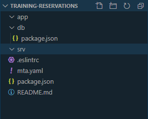

# Exercise 02 - Creating a new CAP project

## Steps

After completing these steps you'll be familiar with how you can use the `cds` command line tool to initialize a project with an OData service.

### 1. Initialize a new CAP project

> Before you start creating a new project we recommend that you create a dedicated directory for this workshop. DO NOT work in `C:\Windows\System32\`.

For any new CAP based project you start by indirectly creating a directory containing various basic files. This can be achieved with the CDS command line tool `cds` which you installed in [exercise 01](../01/).

The `cds` tool should be available in your executable path, having been installed globally as part of the Node.js `@sap/cds-dk` package.

```
cds

USAGE

    cds <command> [<args>]
    cds <src>  =  cds compile <src>
    cds        =  cds help

COMMANDS

    i | init       jump-start cds-based projects
    c | compile    process models selectively
    d | deploy     e.g. to databases or cloud
    s | serve      run servers locally
    w | watch      restart server on file changes
    m | import     add models from external sources
    r | repl       read-eval-event loop
    e | env        get/set cds configuration
    b | build      prepare for deployment
    v | version    get detailed version information
    ? | help       get detailed usage information

  Learn more about each with:
  cds help <command> or
  cds <command> ?
```

Note that with `cds init` a new project can be quickly initialized.

:point_right: You can explore what options are available with `cds init` with the `--help` option:

```
cds init --help
```

For this workshop we are going to create a basic project so you can use following command:

```
cds init training-reservations --add hana,mta
```

If you want to learn more about the options that you can add to the `cds init` command then you can have a look on https://github.com/SAP-samples/cloud-cap-samples or on https://cap.cloud.sap/docs/get-started

### 2. Open the project in VS Code

Now that the project has been initialized, it's time to explore it. The VS Code IDE is a comfortable environment in which to do so, so at this point you will open up the newly created `training-reservations` directory in it.

:point_right: Open up the new `training-reservations` directory in VS Code. One way to do this (if the installation of VS Code on your operating system put the binary in your executable path) is simply by invoking `code` on the command line, and specifying the directory to open:

```
code training-reservations
```

or you can use

```
cd training-reservations
code .
```

### 3. Explore the initialized project structure

The skeleton project that has been initialized is visible in VS Code. This is what it should look like.



:point_right: Examine what files have been populated in the project directory structure.

### 4. Create a simple data model and service definition

:point_right: Create a new file called `schema.cds` in the `db/` directory of the recently created project, copy the following lines to the file and save it:

```cds:
namespace be.canguru.training;

entity Courses {
  key ID        : Integer;
  title         : String;
  description   : String;
  days          : Integer default 1;
  spots         : Integer default 0;
  courseType    : String;
}
```

:point_right: Create a new file called `service.cds` in the `srv/` directory of the recently created project, copy the following lines to the file and save it:

```cds:
using be.canguru.training as training from '../db/schema';

service CourseService {
    entity Courses  as projection on training.Courses;
}
````

You have now created a simple data model as well as a service definition for your project.

### 5. Examine the data model and service definition

The key files in this project as far as the business domain is concerned are the `db/schema.cds` and the `srv/service.cds` files that you just added.

:point_right: Have a brief look at the content of each of these files to get a basic understanding of what's there. Note the use of the `namespace` and how it is defined in the data model and referenced in the service definition. Note also the how the different parts of each file are syntax highlighted.

### 6. Install the dependencies

The `package.json` file that was created when you initialized the project directory contains a list of NPM packages upon which the project is dependent. Before we can start the service up, these dependencies must be installed.

:point_right: Make sure that you are in the the project folder!

```
npm i
```

You should see output that ends something like this:

```
npm notice created a lockfile as package-lock.json. You should commit this file.
added 129 packages from 181 contributors and audited 258 packages in 4.762s
found 0 vulnerabilities
```

:grinning: Supah, now we can start our service!

### 7. Start up the service

In the terminal use the following command to start the service:

```
npm start
```

You should see output similar to this:

```
> training-reservations@1.0.0 start C:\cap\training-reservations
> npx cds run


[cds] - model loaded from 2 file(s):

  db\schema.cds
  srv\service.cds

[cds] - serving CourseService { at: '/course' }

[cds] - launched in: 1766.958ms
[cds] - server listening on { url: 'http://localhost:4004' }
```

The OData service is now running, and available via [http://localhost:4004](http://localhost:4004).

### 8. Explore the OData service

While we have no data in the OData service (we don't even have a persistence layer yet!) we can ask the OData service for the two well-known documents: the service document and the metadata document.

## Summary

With a single command, you've initialized a basic OData service project and with another command you've started it up and explored the metadata.
