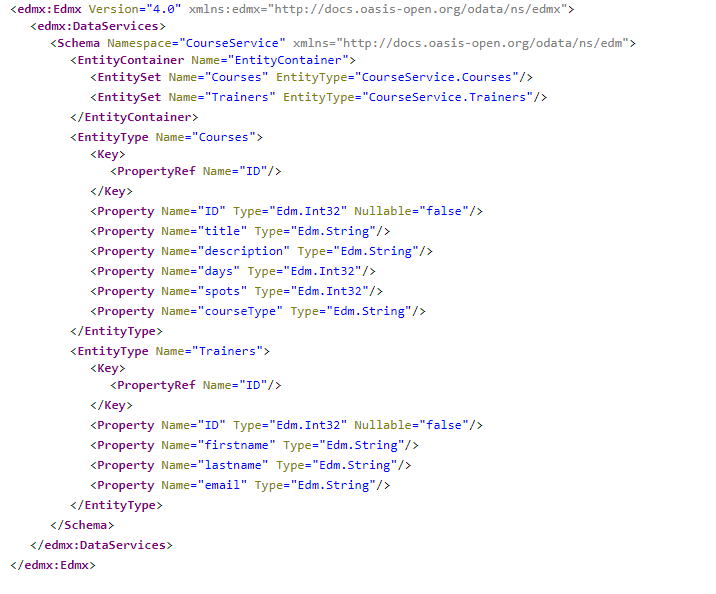
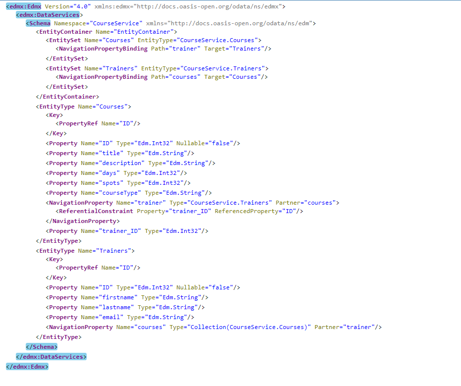

# Exercise 03 - Enhancing the project and adding persistence

In this exercise you'll enhance the basic project by adding new entities in the data model and creating associations between the different entities and you'll also add to the service definition. Also you'll be creating a persistence layer.

## Steps

After completing these steps you'll have a slightly more complex OData service, with three entities that are related to eachother. These will also be backed by an actual persistence layer, provided by SQLite.

### 1. Use `cds watch` to have the service restarting on changes

In order to be able to test your changes faster you can use the `watch`command with the cds command line tool. This will restart the server on file changes.

:point_right: Enter the command `cds watch`in the (integrated) terminal in order to start the server with a watch on file changes.

```
cds watch
```

You should have output like this:

```
[cds] - running nodemon...
--exec cds run --with-mocks --in-memory?
--ext cds,csn,csv,ts,mjs,cjs,js,json,properties,edmx,xml

[cds] - model loaded from 2 file(s):

  db\schema.cds
  srv\service.cds

[cds] - connect to db undefined
[cds] - serving CourseService { at: '/course' }

[cds] - launched in: 2092.497ms
[cds] - server listening on { url: 'http://localhost:4004' }
[ terminate with ^C ]
```

You can now proceed with saving changes to your project and have the service automatically restarted.

### 2. Adding a Trainers entity to the model

Currently the data model is extremely simple. In this step you'll add a second entity `Trainers`.

:point_right: Open the `db/schema.cds` file in VS Code and add a new entity definition, after the `Courses` entity, thus:

```cds
entity Trainers {
  key ID        : Integer;
  firstname     : String;
  lastname      : String;
  email         : String;
}
```

This is deliberately very simple at this point. Don't forget to save the file ... at which point your service should restart automatically thanks to `cds watch`.

:point_right: Open up (or refresh) the [service metadata document](http://localhost:4004/catalog/$metadata) and check for the Trainers entity definition you've just added.

You're right. It's not there.

### 3. Expose the Trainers entity in the service

While there is now a second entity definition in the data model, it is not exposed in the existing service. In this step, you'll remedy that.

:point_right: Open up the `srv/service.cds` file and add a second entity to the `CourseService` definition.

This is what the contents of `srv/service.cds` should look like after you've added the new entity:

```cds
using be.canguru.training as training from '../db/schema';

service CourseService {
    entity Courses  as projection on training.Courses;
    entity Trainers as projection on training.Trainers; 
}
```

:point_right: After the service restarts, check the metadata document once again. The definition of the Trainers entity should now be present in the metadata, and will look something like this:



Ok so far so good, but there's something fundamental that's missing and preventing this data model from being useful.

### 4. Add a relationship between the Courses and Trainers entities

The `Courses` and `Trainers` entities are standalone and currently are not related to each other. This is not ideal, so in this step you'll fix that by adding a relationship in the form of an [association](https://cap.cloud.sap/docs/cds/cdl#associations).

:point_right: Return to the `db/schema.cds` file and add an association from the `Courses` entity to the `Authors` entity, bearing in mind the simplified assumption that a course has a single trainer. The association should describe a new `trainer` property in the `Courses` entity like this:

```cds
entity Courses {
  key ID        : Integer;
  title         : String;
  description   : String;
  days          : Integer default 1;
  spots         : Integer default 0;
  courseType    : String;
  trainer       : Association to Trainers;
}
```

Note that as you type, the CDS Language Services extension for VS Code that you installed in [exercise 01](../01/) provides very useful command completion, recognising the entities defined as well as the CDS syntax itself.

This `Association to Trainers` relationship will allow a consumer to navigate from a course to the related trainer, but not from an trainer to their courses. Let's fix that now by adding a second association.

:point_right: To the `Trainers` entity, add a `courses` property thus:

```cds
entity Trainers {
  key ID        : Integer;
  firstname     : String;
  lastname      : String;
  email         : String;
  courses       : Association to many Courses on courses.trainer = $self;
}
```

Note that this is a 'to-many' relationship.

Don't forget to save the file.

:point_right: After the service has restarted, check the [metadata document](http://localhost:4004/catalog/$metadata) again. There should now be OData navigation properties defined between the two entities, like this:



### 5. Deploy the service to a persistence layer

As it stands, the OData service has no storage. We can actually simulate storage with [service provider](https://cap.cloud.sap/docs/guides/service-impl) logic in JavaScript but that's not a path we want to explore right now. Instead, we'll use a real database in the form of [SQLite](https://sqlite.org) and deploy the data model and service definition to it.

As we want to use a local SQLite database (SQLite was defined in the prerequisites document), we need to install a client library to allow the CAP engine to communicate with this DB.

:point_right: Do that now, i.e. install the `sqlite3` package for this purpose:

```
npm install -D sqlite3
```

Now it's time to make that deployment to the persistence layer.

:point_right: Explore the options for the deploy command like this:

```
cds deploy --help

SYNOPSIS

    cds deploy [ <model> ] [ --to <database> ]

    Deploys the given model to a database. If no model is given it looks up
    according configuration from package.json or .cdsrc.json in key
    cds.requires.db.  Same for the database.

    Supported databases: sqlite, hana

    [...]
```

Use this command to deploy the data model and service definition to a new SQLite-based database (databases with SQLite are simply files on the local filesystem).

:point_right: Deploy to a new SQLite database like this:

```
cds deploy --to sqlite:training-reservations.db
```

This should complete fairly quietly, something like this:

```
/> successfully deployed to ./training-reservations.db
 > updated ./package.json
```

### 6. Explore the new database

At this point you should have a new file `training-reservations.db` in the project directory.

## Summary

You now have a fully functional, albeit simple, OData service backed by a persistence layer, where the data is stored in a local SQLite database file.


