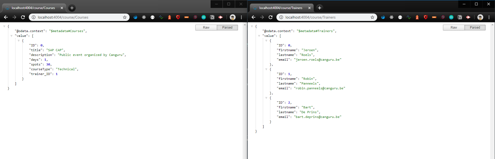

# Exercise 04 - Adding data & testing OData operations

In [exercise 03](../03/) you deployed the service definition (including the referenced data model) to a SQLite-powered persistence layer. While at this stage the OData service is working nicely, we don't yet have data to explore with.

In this exercise you'll seed the persistence layer with data from CSV files, which is often a great way to kick start exploration, development and testing in the early stages of a project.

## Steps

After completing these steps you'll have some courses and trainers data in your OData service and will have explored that data in the browser with OData Query operations.

### 1. Bring sample CSV files in the project

The SAP Cloud Application Programming Model adopts a "convention over configuration" approach in many areas, one of which is the automatic recognition and loading of data from CSV files during a deployment. In this step you'll create a `csv/` directory within the `db/` directory, add two CSV files (one for each of the entities) and redeploy. The deployment process will spot the CSV files and load the contents into the tables in the persistence layer.

:point_right: Create a `csv/` directory within the `db/` directory, and copy into it the CSV files (from this repository) [be.canguru.training-Courses.csv](be.canguru.training-Courses.csv) and [be.canguru.training-Trainers.csv](be.canguru.training-Trainers.csv). Use the "Raw" link from within each of these GitHub resources to get the actual CSV data to download (and don't forget to ensure the `.csv` extension is used for the files that you save).

### 2. Redeploy to the persistence layer

The CSV files are discovered and used during a `cds deploy`, so a new deployment is required. While the `cds watch` will restart the service, it won't do a deploy for us, so we'll do that manually now.

:point_right: Deploy again, this time noting that you don't have to specify the `--to` option:


```
cds deploy
```

During deployment this time you should see extra messages:

```
 > filling be.canguru.training.Courses from db\data\be.canguru.training-Courses.csv
 > filling be.canguru.training.Trainers from db\data\be.canguru.training-Trainers.csv
/> successfully deployed to ./training-reservations.db
```

### 3. Restart the service

:point_right: Now the data's been loaded, you should fire up `cds watch` again:

```
cds watch
```

Now the [Courses](http://localhost:4004/course/Courses) and [Trainers](http://localhost:4004/course/Trainers) entitysets in the OData service will show data in response to OData Query and Read operations.



### 4. Try out some OData Query operations

The [OData standard](https://www.odata.org/) describes a number of different operations - Create, Read, Update, Delete and Query (otherwise known as 'CRUD+Q'). With your browser you can try out Read and Query operations directly.

:point_right: Try out a few Read and Query operations on the data in the service like this:

| Read / Query | URL |
| ----- | --- |
| Show all courses | http://localhost:4004/course/Courses |
| Show all trainers | http://localhost:4004/course/Trainers |
| Retrieve course with ID 1 | http://localhost:4004/course/Courses(1) |
| Retrieve trainer with ID 1 and also their courses | http://localhost:4004/course/Trainers(1)?$expand=courses |


## Summary

Your OData service now has sample data that you can access via OData operations.