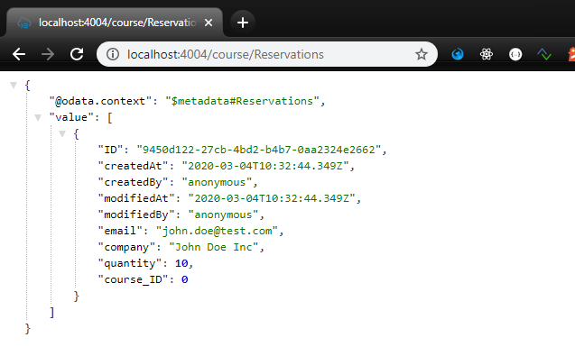

# Exercise 05 - Adding Reservations entity and use generic features

In this exercise you'll add a further entity to the data model and expose it through the service. In defining this entity you'll make use of some [generic features](https://cap.cloud.sap/docs/cds/common) available for all CAP projects.

## Steps

At the end of these steps you'll have a third entity `Reservations`, and will have performed some OData Create operations upon it.

### 1. Add a new entity Reservations

We need to be able to maker reservations on courses, so we'll need a Reservations entity in our data model.

:point_right: Open the `db/schema.cds` file and first of all add this third entity (not forgetting to save the file when you're done):

:point_right: First make sure we can use the generic features, we'll explain you what they are

```cds
using { 
    managed, 
    cuid
} from '@sap/cds/common';
```

:point_right: Then we need to create our reservations entity below our other two entities:

```
entity Reservations : cuid, managed {
  email         : String;
  company       : String;
  quantity      : Integer default 1;

// Assoc
  course        : Association to Courses;
}
```

You will notice that we create an association from our `Reservations` entity towards the `Courses`, this because a reservation is always tied together with a specific course.

:point_right: So we need to create the reverse association in the course entity also. Add following line to the `Courses` entity:

```cds
reservations  : Association to many Reservations on reservations.course = $self;
```

We're not quite done with this entity, but for now, you're about to have a first look at the fruits of your labor by adding a new entry to the service definition for this entity.

:point_right: Add the entry to the `CourseService` service definition in the `srv/service.cds` file:

```
service CourseService {
    entity Courses            as projection on training.Courses 
    entity Trainers           as projection on training.Trainers
    entity Reservations       as projection on training.Reservations    // <-- new
}
```

:point_right: Noting that your service has been automatically restarted (by `cds watch`) already, take a look at the new `Orders` entity: <http://localhost:4004/course/Reservations>.

You should see an error both in the response returned, and in the service log output, that looks something like this:

```
SQLITE_ERROR: no such table: CourseService_Reservations
```

That's because we still need to deploy the changes to the persistence layer, to have a new table and view created there for the `Reservations` entity.

:point_right: Do this now (note that the CSV data will be used again to seed the tables):

```
cds deploy
```

:point_right: Once you've redeployed, restart `cds watch`:

```
cds watch
```

The `Reservations` entity is now available in the service (but there is [no data](http://localhost:4004/course/Reservations) as yet).

:point_right: Investigate the metadata and note down the properties, as you will need them for the create.


### 2. Create some entries in the Reservations entity

Put the new entity through its paces by performing some OData Create operations to insert reservation. An OData Create operation is carried out with an HTTP POST request. If you're confident on the command line and have `curl` installed, you can do this with those tools. Otherwise, you can use Postman.

An OData Create operation (request and response) to insert a new order looks in raw form like this:

Request:
```
POST /course/Reservations HTTP/1.1
Host: localhost:4004
Content-Type: application/json
Content-Length: 29

{
  "email": "john.doe@test.com",
  "company": "John Doe Inc",
  "quantity": 10,
  "course_ID": 0 
}
```

This should now have created a new [Reservation](http://localhost:4004/course/Reservations), like below:



Note that there a couple of properties generated and filled for our Reservation.

## Summary

At this point you have a meaningful OData service with data and against which you are now confidently performing various read and write OData operations.