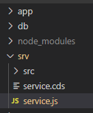
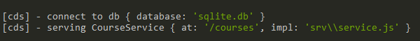
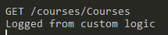
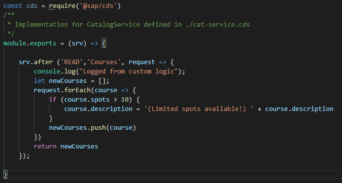
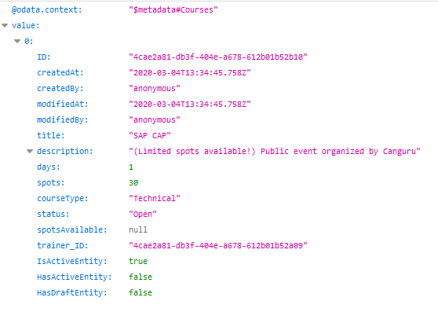

# Exercise 06 - Adding custom logic

In this exercise you'll add [custom logic](https://cap.cloud.sap/docs/guides/service-impl) to the service. 

Adding custom logic allows you to react on pre-defined hooks in JavaScript. Those allow you to change the behaviour of the service with minimal effort.


In this section we assume that command ```cds watch``` is executed, so that all changes are automatically processed.

## Steps

At the end of this section you'll have implemented checks and calculated the available spots on a course.

### 1. Add custom logic file

All custom logic for a service is contained in a JavaScript file with the same name as the service.

:point_right: Create a new file in the service folder with the same name as the service.



### 2. Basic structure

:point_right: Add this sceleton to the file:

```const cds = require('@sap/cds')
/**
 * Implementation for CatalogService defined in ./cat-service.cds
 */
module.exports = (srv) => {    

    srv.after ('READ','Courses', async (request) => {
        console.log("Logged from custom logic");
    });
}
```

### 3. Test the custom logic

When starting the service you'll see (in your powershell/terminal):



When requesting all courses from the service you'll see the custom was triggered:



### 4. Doing custom the exciting way

Replace the code we added above with:

```const cds = require('@sap/cds')
/**
 * Implementation for CatalogService defined in ./cat-service.cds
 */
module.exports = (srv) => {    

    srv.after ('READ','Courses', request => {
        console.log("Logged from custom logic");
        let newCourses = [];
        request.forEach(course => {
            if (course.spot < 10) {
                course.description = '(Limited spots available!) ' + course.description
            }
            newCourses.push(x)
        })
        return newCourses
    });
}
```

So the result looks like:



When requesting the courses via the service the custom logic is called and when the condition is met, the description will be changed:

