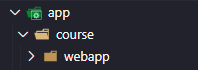
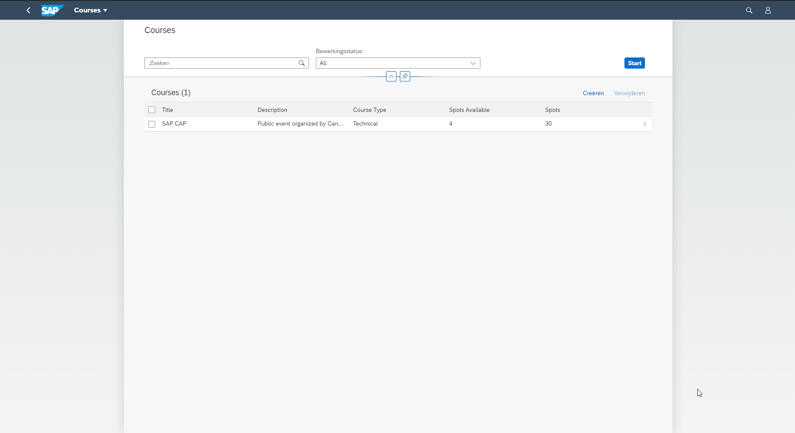
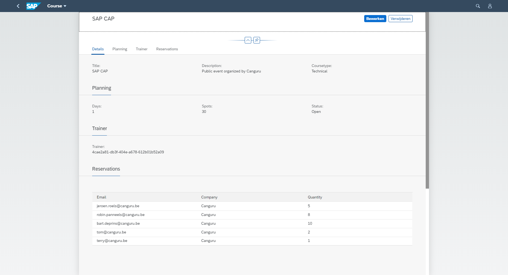

# Exercise 07 - Adding the UI

In this exercise you will get comfortable with SAP Annotations. 

## Steps

At the end of this section, a list will be displayed with the courses stored in the offline database.
When clicking on an item, a navigation will be triggered to a detail page. 

### 1. Create a Launchpage 

In order to be able to display several applications, we will create a launchpage.

Open the 'app' folder, create a fiori.html and copy the following sceleton:

```
<!DOCTYPE html>
<html>
    <head>

        <meta http-equiv="X-UA-Compatible" content="IE=edge" />
        <meta http-equiv="Content-Type" content="text/html;charset=UTF-8" />
        <meta name="viewport" content="width=device-width, initial-scale=1.0" />
        <title>Course</title>

        <script>
            window["sap-ushell-config"] = {
                defaultRenderer: "fiori2",
                applications: {
                    "browse-courses": {
                        title: "Browse Course",
                        description: "Overzicht van courses",
                        additionalInformation: "SAPUI5.Component=course",
                        applicationType : "URL",
                        url: "/course/webapp",
                        navigationMode: "embedded"
                    }
                }
            };
        </script>

        <script src="https://sapui5.hana.ondemand.com/test-resources/sap/ushell/bootstrap/sandbox.js"></script>
        <script src="https://sapui5.hana.ondemand.com/resources/sap-ui-core.js"
            data-sap-ui-libs="sap.m, sap.ushell, sap.collaboration, sap.ui.layout"
            data-sap-ui-compatVersion="edge"
            data-sap-ui-theme="sap_fiori_3"
            data-sap-ui-frameOptions="allow"
        ></script>
        <script>
            sap.ui.getCore().attachInit(
                () => sap.ushell.Container.createRenderer().placeAt("content")
            )
        </script>

    </head>
    <body class="sapUiBody" id="content"></body>
</html>
```

:point_right: The launchpage will be available on our localhost with one application -> courses

### 2. Create an application folder

:point_right: Create the 'course' folder
This folder will bundle the UI related logic for the courses service. 

:point_right: Create a 'webapp' folder in the course

At this point you should see the following folder setup:


### 3. Create the container application

Create a container application to run the annotations

:point_right: Create the manifest.json
```
{
	"_version": "1.8.0",
	"sap.app": {
		"id": "courses",
		"type": "application",
		"title": "Courses",
		"description": "Sample Application",
		"i18n": "i18n/i18n.properties",
		"dataSources": {
			"CourseService": {
				"uri": "/course/",
				"type": "OData",
				"settings": {
					"odataVersion": "4.0"
				}
			}
		},
        "-sourceTemplate": {
            "id": "ui5template.basicSAPUI5ApplicationProject",
			"-id": "ui5template.smartTemplate",
			"-version": "1.40.12"
		}
	},
	"sap.ui5": {
        "dependencies": {
            "libs": {
                "sap.fe": {}
            }
        },
		"models": {
			"i18n": {
				"type": "sap.ui.model.resource.ResourceModel",
				"uri": "i18n/i18n.properties"
			},
			"": {
				"dataSource": "CourseService",
				"settings": {
                    "synchronizationMode": "None",
                    "operationMode": "Server",
                    "autoExpandSelect" : true,
                    "earlyRequests": true,
                    "groupProperties": {
                        "default": {
                          "submit": "Auto"
                        }
                    }
				}
			}
		},
        "routing": {
            "routes": [
            ],
            "targets": {
            }
        },
		"contentDensities": {
			"compact": true,
			"cozy": true
		}
	},
	"sap.ui": {
		"technology": "UI5",
		"fullWidth": false
	},
	"sap.fiori": {
		"registrationIds": [],
		"archeType": "transactional"
	}
}
```

:point_right: Create the Component.js
```
sap.ui.define(["sap/fe/AppComponent"], 
    ac => ac.extend("course.Component", {
        metadata: { 
            manifest:'json' 
        }
    })
)

```

### 4. Add course related annotations

Next to the webapp folder, we will create a 'fiori-service.cds' file that contains the UI 
of our course application.

Open the file and add following annotations:

```
using CourseService from '../../srv/service';

annotate CourseService.Courses with @(
	UI: {
    }
) { };

```

### 4. Preload annotations

In the app folder, create an index.cds and paste the following code:

```
/* This model controls what gets served to Fiori frontends... */

using from './course/fiori-service';

```

### 5. Add a list to the application

Open the 'fiori-service.cds' and a list to the UI object:

``` 
// List View 			
SelectionFields: [],
LineItem: [
    //The following entry is only used to have the association followed in the read event
    {Value: title, 			Label:'Title'},
    {Value: description, 	Label:'Description'},
    {Value: courseType, 	Label:'Course Type'},
    {Value: spots, 			Label:'Spots'}
],
```

Create a new route in your manifest.json with corresponding target:
Route:
```
{
    "pattern": ":?query:",
    "name": "CourseList",
    "target": "CourseList"
}
```
Target:
```
"CourseList": {
    "type": "Component",
    "id": "CourseList",
    "name": "sap.fe.templates.ListReport",
    "options": {
        "settings" : {
            "entitySet" : "Courses",
            "navigation" : {
                "Courses" : {
                    "detail" : {
                        "route" : "CourseDetails"
                    }
                }
            }
        }
    }
}
```

You should see an output similar to this:  


### 6. Add navigation with a detail view

Open the 'fiori-service.cds' and a list to the UI object:

``` 
// Detail View
HeaderInfo: {
    TypeName: 'Course',
    TypeNamePlural: 'Courses',
    Title: {
        Value: title
    }
},

Facets: [
    {$Type: 'UI.ReferenceFacet', Label: 'Details', 		Target: '@UI.FieldGroup#Details'},
    {$Type: 'UI.ReferenceFacet', Label: 'Planning', 	Target: '@UI.FieldGroup#Planning'},
    {$Type: 'UI.ReferenceFacet', Label: 'Trainer', 		Target: '@UI.FieldGroup#Trainer'},
    {$Type: 'UI.ReferenceFacet', Label: 'Reservations', Target: 'reservations/@UI.LineItem#reservations'}
],

FieldGroup#Details: {
    Data: [
        {Value: title, Label:'Title'},
        {Value: description, Label:'Description'},
        {Value: courseType, Label:'Coursetype'}
        
    ]
},

FieldGroup#Planning: {
    Data: [
        {Value: days, Label:'Days'},
        {Value: spots, Label:'Spots'}
    ]
},

FieldGroup#Trainer: {
    Data: [
        {Value: trainer_ID, Label:'Trainer'}
    ]
}
```

Create a new route in your manifest.json with corresponding target:
Route:
```
{
    "pattern": ":?query:",
    "name": "CourseList",
    "target": "CourseList"
},
{
    "pattern": "Courses({key})",
    "name": "CourseDetails",
    "target": "CourseDetails"
}
```
Target:
```
"CourseList": {
    "type": "Component",
    "id": "CourseList",
    "name": "sap.fe.templates.ListReport",
    "options": {
        "settings" : {
            "entitySet" : "Courses",
            "navigation" : {
                "Courses" : {
                    "detail" : {
                        "route" : "CourseDetails"
                    }
                }
            }
        }
    }
},
"CourseDetails": {
    "type": "Component",
    "id": "CourseDetails",
    "name": "sap.fe.templates.ObjectPage",
    "options": {
        "settings" : {
            "entitySet": "Courses"							
        }
    }
}
```

You should see an output similar to this:  



### 7. Add expands to the UI

Replace the empty brackets with the following expands at the end of 
annotate CourseService.Courses with @(
	UI: {
    }
) { }; <--

``` 
{
	createdAt @UI.HiddenFilter:false;
	createdBy @UI.HiddenFilter:false; 

	trainer @ValueList.entity:'Trainers';
	courseType @ValueList.entity:'courseType';
	reservations @ValueList.entity:'Reservations';
}
``` 

Add the following annotations underneath 'annotate CourseService.Course'

``` 
annotate CourseService.Trainers with @(
	UI: {
		Identification: [
			{Value:fullName}
		]
	}
);

annotate CourseService.Reservations with @(
	UI: {
		LineItem#reservations: [
			{Value: email, Label:'Email'},
			{Value: company, Label:'Company'},
			{Value: quantity, Label:'Quantity'},
		]
	},
);
``` 

If necessary, double check the **prerequisites document**  to install the missing tools. Please contact one of the instructors if you need help.